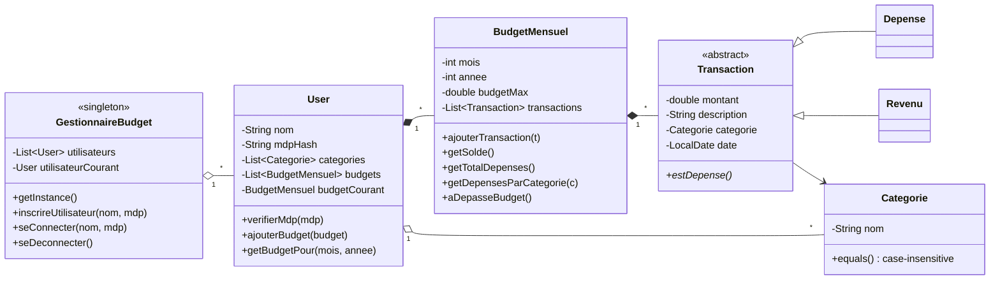

# GestionnaireBudget — Personal Budget Manager (Java, console)

> A console application to manage a personal budget: user accounts, monthly budgets with a spending limit, income and expense tracking by category, and a history of past months. Written in **pure Java** with an object-oriented design, custom exceptions and file persistence.


---

## Table of contents

- [Features](#features)
- [Demo](#demo)
- [Architecture](#architecture)
- [Design choices](#design-choices)
- [Getting started](#getting-started)
- [Project structure](#project-structure)
- [Known issues](#known-issues)
- [Roadmap](#roadmap)
- [Author](#author)

---

## Features

**Accounts**
- Sign up and log in with a username and password
- Several users on the same installation, each with their own data
- Log out and switch users without restarting

**Monthly budgets**
- Create a budget for a given month and year with a maximum spending limit
- **Expenses that would exceed the limit are refused**
- Consult the balance, total income and total expenses of the current month
- Look up any past month (final balance, total expenses)

**Transactions and categories**
- Record income (*Revenu*) and expenses (*Dépense*) with amount, description, category and date (today by default)
- Categories are created on the fly the first time they are used, or managed from a dedicated menu
- Category names are case-insensitive (`Alimentation` = `alimentation`)
- List all transactions, all expenses, or expenses for one category with their total

**Robustness**
- Input validation on every field: positive amounts, month between 1 and 12, `YYYY-MM-DD` dates, non-empty names
- Clear error messages instead of crashes, through custom exceptions

## Demo

Real output of the application (the interface is in French):

```text
=== BUDGET 10/2026 ===
Budget max : 1000.00€
Solde actuel : -320.50€
Dépenses totales : 320.50€
Revenus totaux : 0.00€
Budget dépassé : NON ✅

=== LISTE DES TRANSACTIONS ===
[Dépense] 320.50€ - Courses du mois (Alimentation) - 2026-10-05
```

Trying to add a €900 expense to this €1,000 budget is refused:

```text
Catégorie : ✅ Nouvelle catégorie 'High-tech' ajoutée automatiquement
Date (AAAA-MM-JJ) [laissez vide pour aujourd'hui] : ❌ Budget dépassé !
```

### Menus

```
Logged out            Logged in              Budget management
──────────            ─────────              ─────────────────
1. Log in             1. Manage budget  ──►  1. Add a transaction
2. Sign up            2. Add a monthly       2. Show balance
3. Quit                  budget              3. List transactions
                      3. Log out             4. Expenses by category
                      4. Quit                5. All expenses
                                             6. Manage categories
                                             7. Past budget
                                             8. Back
```

## Architecture



| Package | Contents |
|---|---|
| `app` | `Main`: console menus, input reading, user interaction |
| `corps` | Domain model: `GestionnaireBudget`, `User`, `BudgetMensuel`, `Transaction`, `Depense`, `Revenu`, `Categorie` |
| `exceptions` | `SaisieInvalideException`, `AuthentificationException`, `DepassementBudgetException` |
| `utils` | `Sauvegarder`: saving and loading application data |

## Design choices

- **Inheritance and polymorphism.** `Transaction` is abstract; `Depense` and `Revenu` implement `estDepense()`. Balance and totals are computed without ever checking a concrete type: `getSolde()` adds income and subtracts expenses based on that method alone.
- **Validation in the model.** The `Transaction` constructor rejects a non-positive amount, an empty description, or a missing category or date. An invalid transaction can't exist, whatever the caller does.
- **Business rules as exceptions.** Exceeding the budget is a `DepassementBudgetException`, a failed login an `AuthentificationException`, invalid input a `SaisieInvalideException`. The console layer catches them and shows a message, so the model never prints anything.
- **Singleton.** `GestionnaireBudget` is the single entry point to application state.
- **Encapsulation.** Getters return **copies** of internal lists (`new ArrayList<>(…)`), so callers can't modify a budget's transactions behind its back. Fields are `final` wherever possible.
- **Streams.** Totals, filters by category and searches by period are written with the Stream API (`filter`, `mapToDouble`, `sum`, `collect`).
- **Value equality for categories.** `equals()` and `hashCode()` are overridden and case-insensitive, so `contains()` detects duplicate categories correctly.

## Getting started

### Prerequisites

- **JDK 8 or later** (`java -version` to check)

### Compile and run from the terminal

```bash
git clone https://github.com/AyoubElmortaji/GestionnaireBudget.git
cd GestionnaireBudget

# Compile every source file into the "classes" folder
javac -encoding UTF-8 -d classes $(find src -name "*.java")

# Run the entry point (app.Main), using the compiled classes
java -cp classes app.Main
```

On Windows (PowerShell):

```powershell
javac -encoding UTF-8 -d classes (Get-ChildItem -Recurse src -Filter *.java).FullName
java -cp classes app.Main
```

> If accented characters or emoji display incorrectly, run `chcp 65001` first on Windows, or add `-Dstdout.encoding=UTF-8` to the `java` command (Java 18+).

### Or with IntelliJ IDEA

Open the folder as a project (an `.iml` file is included) and run `app.Main`.

## Project structure

```
GestionnaireBudget/
├── src/
│   ├── app/
│   │   └── Main.java                       # console interface
│   ├── corps/
│   │   ├── GestionnaireBudget.java         # singleton: users and session
│   │   ├── User.java                       # account, categories, budgets
│   │   ├── BudgetMensuel.java              # monthly budget and its transactions
│   │   ├── Transaction.java                # abstract base class
│   │   ├── Depense.java                    # expense
│   │   ├── Revenu.java                     # income
│   │   ├── Categorie.java
│   │   └── CategorieFixe.java              # draft, commented out
│   ├── exceptions/
│   │   ├── AuthentificationException.java
│   │   ├── DepassementBudgetException.java
│   │   └── SaisieInvalideException.java
│   └── utils/
│       └── Sauvegarder.java                # persistence (Java serialization)
└── GestionnaireBudget.iml                  # IntelliJ project file
```

## Known issues

- **Data is not saved.** `Sauvegarder` writes application state with Java serialization, but `BudgetMensuel` doesn't implement `Serializable`. Since every user gets a budget at sign-up, saving fails with `NotSerializableException` ("Erreur lors de la sauvegarde") and all data is lost when the application closes. Adding `implements Serializable` to `BudgetMensuel` fixes it.
- **Weak password storage.** Passwords are stored as `String.hashCode()`, a 32-bit non-cryptographic hash with no salt. Collisions are trivial: `"Aa"` and `"BB"` have the same hash, so a different password can open the account.
- **The session is saved with the data.** The logged-in user (`utilisateurCourant`) is serialized along with everything else. Once saving works, quitting without logging out means the next launch opens that user's account without asking for a password. The field should be marked `transient`.
- **Duplicate usernames.** Sign-up doesn't check whether the name is already taken; only the first account with a given name can log in.
- **Unsafe persistence format.** Java native deserialization of a file that could be replaced is a known attack vector (insecure deserialization).
- **No edit or delete** for transactions, categories or budgets.
- **Transaction type.** Any choice other than `1` is recorded as income.

## Roadmap

- [ ] Fix persistence (`BudgetMensuel implements Serializable`), then move to a human-readable format (JSON) instead of native serialization
- [ ] Hash passwords with a salted, slow algorithm (PBKDF2 or bcrypt) and hide input with `Console.readPassword()`
- [ ] Exclude the current session from saved data (`transient utilisateurCourant`)
- [ ] Reject duplicate usernames at sign-up
- [ ] Edit and delete transactions
- [ ] Monthly report by category with percentages
- [ ] CSV export
- [ ] Unit tests (JUnit) for `BudgetMensuel` and `Transaction`
- [ ] Maven or Gradle build

## Author

**Ayoub ELMORTAJI** — Engineering student in Cybersecurity & Cloud Computing, ENSAM Casablanca · [GitHub](https://github.com/AyoubElmortaji)
